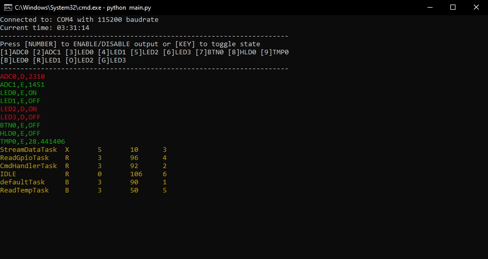
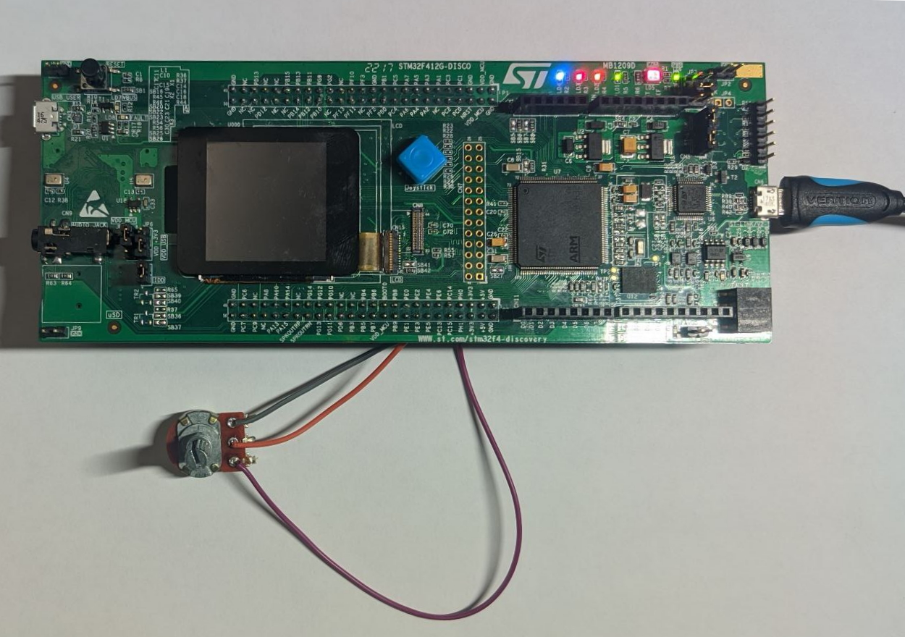

# technolab-test-task

Тестовое задание на разработку устройства со стримингом данных по UART в CLI-приложение

## Структура папок

* `fw` - проект на `FreeRTOS` под `STM32F412 Discovery`
* `sw` - python-утилита для мониторинга и отправки команд

## Внешний вид CLI
|Консольное приложение StreamLineCLI|
|---|
||

## Внешний вид макета устройства

|Макет StreamLine|
|---|
||

## Функционал

* Отображение данных и состояния в потоке через UART:
  * `ADC0` - Канал АЦП - `ADC1_IN4` на `PA4`
  * `ADC1` - Канал АЦП - `ADC1_IN5` на `PA5`
  * `LED0` - Синий светодиод - `GPIO_Output` на `PE3`
  * `LED1` - Красный светодиод - `GPIO_Output` на `PE2`
  * `LED2` - Оранжевый светодиод - `GPIO_Output` на `PE1`
  * `LED3` - Зеленый светодиод - `GPIO_Output` на `PE0`
  * `BTN0` - Событие нажатия кнопки джойстика - `GPIO_EXTI0` на `PG0`
  * `HLD0` - Событие удержания кнопки джойстика 5 секунд - `GPIO_EXTI0` на `PG0`
  * `TMP0` - Канал АЦП - `Temperature Sensor Channel`
  * `FTH0` - вывод FreeRTOS функции `vTaskInfo`
* Запрет/Разрешение на обновление данных по UART
* Управление светодиодами по UART
* Сохранение потока в текстовый файл с проставлением временной метки

## ToDo

* Написать unit-тесты на проверку каждой команды и возвращаемого результата
* Добавить команду начать/остановить поток
* Добавить команду разрешить/запретить обновление `FTH0`